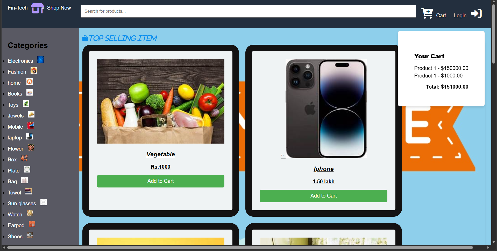
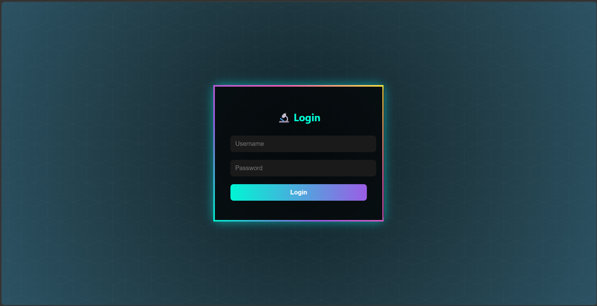

<p align="center">
  
</p>
# 🛒 QuickMart

### Modern E-Commerce Website Built with HTML • CSS • JavaScript

<p align="center">


</p>

<p>


</p>

</div>

---

# 📖 About

QuickMart is a modern front-end shopping website inspired by leading e-commerce platforms.

The project demonstrates how a complete shopping interface can be built using only HTML, CSS and JavaScript without any frameworks.

It includes a clean shopping interface, product listings, category navigation, shopping cart functionality and a futuristic login page.

---

# ✨ Features

- 🛍️ Modern Shopping UI
- 🔍 Search Bar
- 📦 Product Categories
- 🛒 Shopping Cart
- 💳 Clean Product Cards
- 🔐 Stylish Login Page
- 🎨 Responsive Layout
- ⚡ Pure HTML CSS JavaScript
- 🌈 Font Awesome Icons
- 🚀 Beginner Friendly

---

# 🖼️ Screenshots

## 🏠 Homepage

<p align="center">



</p>

---

## 🔐 Login Page

<p align="center">



</p>

---

# ⚙️ Tech Stack

| Technology | Purpose |
|------------|---------|
| HTML5 | Website Structure |
| CSS3 | Styling & Layout |
| JavaScript | Shopping Cart |
| Font Awesome | Icons |

---

# 📂 Project Structure

```text
Fin-Tech
│
├── index.html
├── ama.css
├── ama.js
├── l.html
├── l.css
│
├── assets
│   ├── banner.png
│   ├── logo.png
│   ├── homepage.png
│   └── login.png
│
└── README.md
```

---

# 🚀 Getting Started

Clone the repository

```bash
git clone https://github.com/Shivan241/Fin-Tech.git
```

Go inside project

```bash
cd Fin-Tech
```

Open

```text
index.html
```

in your browser.

No installation required.

---

# 📸 Website Preview

<div align="center">

<a href="assets/homepage.png">
  
</a>

<a href="assets/login.png">
  
</a>

</div>

---

# 🚧 Upcoming Features

- User Authentication

- Wishlist

- Product Search

- Product Filter

- Payment Gateway

- Order History

- User Dashboard

- Admin Panel

- Responsive Mobile Design

- Dark Mode

- Product Database

---

# 💻 Languages Used

```text
HTML        ████████████████████████ 50%

CSS         ████████████████         30%

JavaScript  █████████                20%
```

---

# 🌍 Live Demo

<p align="center">

<a href="https://shivan241.github.io/Fin-Tech/" target="_blank">
  
</a>

</p>

> 🔗 **Website:** https://shivan241.github.io/Fin-Tech/

---

# 🤝 Contributing

Contributions are welcome.

1. Fork Repository

2. Create Feature Branch

3. Commit Changes

4. Push Branch

5. Open Pull Request

---

# ⭐ Support

If you like this project

⭐ Star the repository

🍴 Fork it

📢 Share it

---

<div align="center">

## Developed by Shivan

Made using HTML • CSS • JavaScript

</div>
